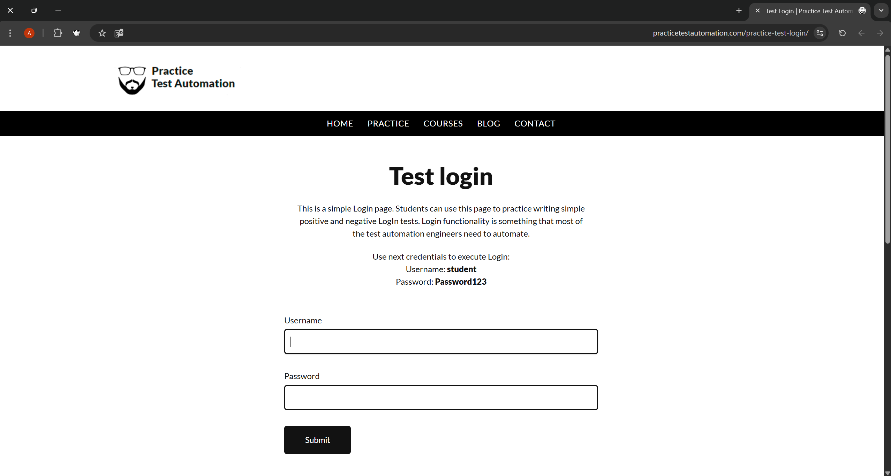
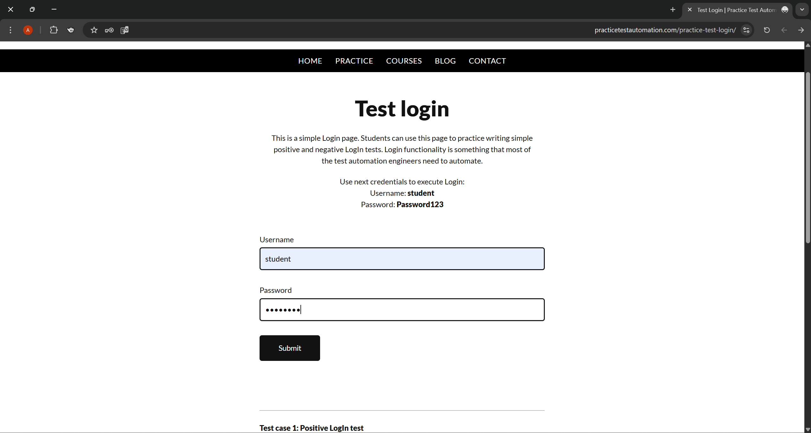
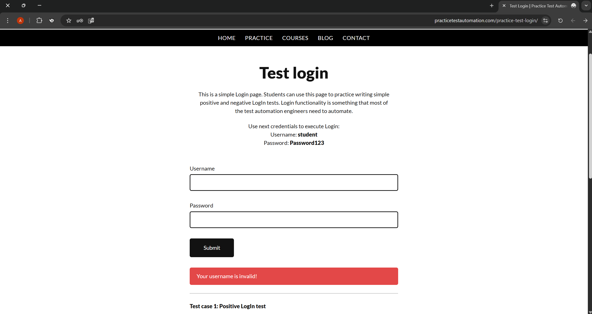

# Manual Testing Project – Login System

## 📌 Overview
This project demonstrates manual testing of a login system by designing and executing test cases and validating different user scenarios.

## 🧪 Test Scenarios
- Valid login  
- Invalid login  
- Empty fields validation  
- Error message handling  

## 🛠 Tools Used
- Manual Testing  
- Test Case Design  

## 📊 Results
- Executed multiple test cases  
- Verified system behavior  
- Identified validation and error handling issues  

## 📸 Screenshots

### Login Page

### Successful Login

### Invalid Password

